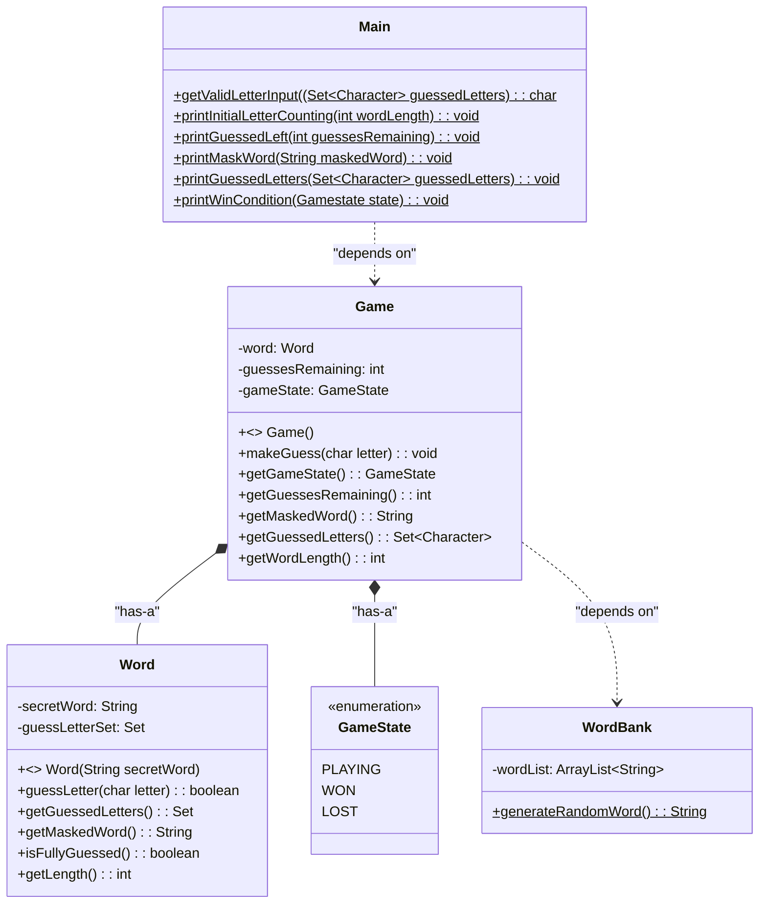

### UML Diagram

```mermaid
classDiagram
    class GameState{
        <<enumeration>>
        PLAYING
        WON
        LOST
    }
    class WordBank {
        -wordList: ArrayList~String~
        +generateRandomWord(): String$
    }
    class Word{
        -secretWord: String
        -guessLetterSet: Set<Character>
        +<<constructor>> Word(String secretWord)
        +guessLetter(char letter): boolean
        +getGuessedLetters(): Set<Character>
        +getMaskedWord(): String
        +isFullyGuessed(): boolean
        +getLength(): int
    }
    class Game{
        -word: Word
        -guessesRemaining: int
        -gameState: GameState
        +<<constructor>> Game()
        +makeGuess(char letter): void
        +getGameState(): GameState
        +getGuessesRemaining(): int
        +getMaskedWord(): String
        +getGuessedLetters(): Set~Character~
        +getWordLength(): int
    }
    class Main{
        +getValidLetterInput((Set~Character~ guessedLetters): char$
        +printInitialLetterCounting(int wordLength): void$
        +printGuessedLeft(int guessesRemaining): void$
        +printMaskWord(String maskedWord): void$
        +printGuessedLetters(Set~Character~ guessedLetters): void$
        +printWinCondition(Gamestate state): void$
    }
    Game *-- Word: "has-a"
    Game *-- GameState: "has-a"
    Game ..> WordBank: "depends on"
    Main ..> Game: "depends on"
```
